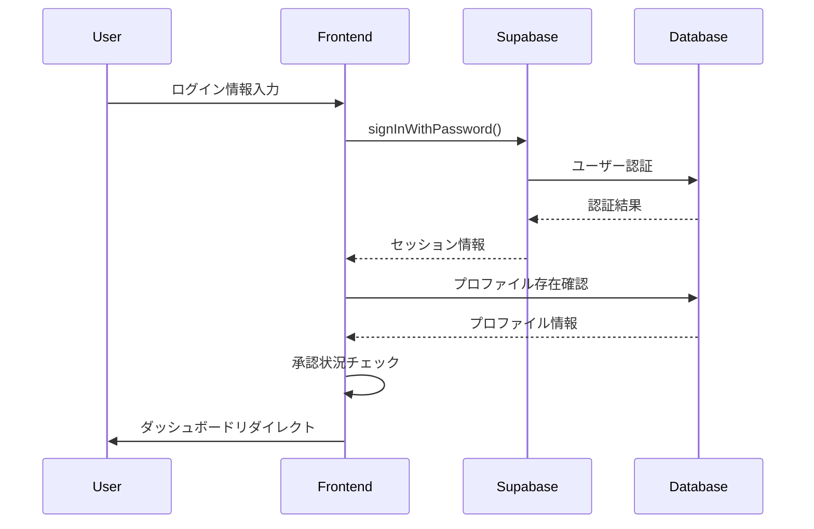

# イベント実績分析ツール - 詳細設計書

## 1. システム アーキテクチャ

### 1.1 全体アーキテクチャ図
```
┌─────────────────┐    ┌──────────────────┐    ┌─────────────────┐
│   Frontend      │    │   Backend API    │    │   Database      │
│   Next.js       │◄──►│   Next.js API    │◄──►│   Supabase      │
│   React/TS      │    │   Routes         │    │   PostgreSQL    │
└─────────────────┘    └──────────────────┘    └─────────────────┘
        │                       │                       │
        │                       │                       │
        ▼                       ▼                       ▼
┌─────────────────┐    ┌──────────────────┐    ┌─────────────────┐
│   Client Side   │    │   Server Side    │    │   Storage       │
│   - State Mgmt  │    │   - Auth Logic   │    │   - File Upload │
│   - Form Logic  │    │   - Data Process │    │   - Image Store │
│   - UI Render   │    │   - Validation   │    │   - Backup      │
└─────────────────┘    └──────────────────┘    └─────────────────┘
```

### 1.2 技術スタック詳細

#### フロントエンド
- **Next.js 14.2.5**: App Router + RSC
- **React 18.3.1**: Hooks + Functional Components
- **TypeScript 5.5.4**: 型安全性
- **Tailwind CSS 3.4.6**: ユーティリティファーストCSS
- **React Hook Form 7.52.1**: フォーム管理
- **Zod 3.23.8**: バリデーション
- **Recharts 2.12.7**: チャートライブラリ
- **Lucide React 0.414.0**: アイコンライブラリ

#### バックエンド
- **Next.js API Routes**: サーバーレスAPI
- **Supabase 2.56.1**: BaaS (Authentication + Database + Storage)
- **Supabase SSR 0.7.0**: サーバーサイドレンダリング対応
- **Prisma 5.17.0**: ORM (開発用)

#### 開発・ビルドツール
- **ESLint**: コード品質チェック
- **Autoprefixer**: CSS自動プリフィックス
- **PostCSS**: CSS前処理

## 2. データベース詳細設計

### 2.1 Supabase テーブル設計

#### events テーブル
```sql
CREATE TABLE events (
    id UUID PRIMARY KEY DEFAULT uuid_generate_v4(),
    venue VARCHAR(255) NOT NULL,              -- 会場
    agency_name VARCHAR(255) NOT NULL,        -- 代理店名
    start_date DATE NOT NULL,                 -- 開始日
    end_date DATE NOT NULL,                   -- 終了日
    year INTEGER NOT NULL,                    -- 年
    month INTEGER NOT NULL,                   -- 月
    week_number INTEGER NOT NULL,             -- 週番号
    created_at TIMESTAMP DEFAULT NOW(),
    updated_at TIMESTAMP DEFAULT NOW()
);
```

#### event_performances テーブル
```sql
CREATE TABLE event_performances (
    id UUID PRIMARY KEY DEFAULT uuid_generate_v4(),
    event_id UUID REFERENCES events(id) ON DELETE CASCADE,
    
    -- 目標値
    target_hs_total INTEGER DEFAULT 0,       -- HS合計目標
    target_au_mnp INTEGER DEFAULT 0,         -- au MNP目標
    target_uq_mnp INTEGER DEFAULT 0,         -- UQ MNP目標  
    target_au_new INTEGER DEFAULT 0,         -- au 新規目標
    target_uq_new INTEGER DEFAULT 0,         -- UQ 新規目標
    
    -- 実績集計値 (全スタッフ・全日合計)
    total_au_mnp_sp1 INTEGER DEFAULT 0,      -- au MNP SP1合計
    total_au_mnp_sp2 INTEGER DEFAULT 0,      -- au MNP SP2合計
    total_au_mnp_sim INTEGER DEFAULT 0,      -- au MNP SIM合計
    total_uq_mnp_sp1 INTEGER DEFAULT 0,      -- UQ MNP SP1合計
    total_uq_mnp_sp2 INTEGER DEFAULT 0,      -- UQ MNP SP2合計
    total_uq_mnp_sim INTEGER DEFAULT 0,      -- UQ MNP SIM合計
    
    total_au_hs_sp1 INTEGER DEFAULT 0,       -- au HS SP1合計
    total_au_hs_sp2 INTEGER DEFAULT 0,       -- au HS SP2合計
    total_au_hs_sim INTEGER DEFAULT 0,       -- au HS SIM合計
    total_uq_hs_sp1 INTEGER DEFAULT 0,       -- UQ HS SP1合計
    total_uq_hs_sp2 INTEGER DEFAULT 0,       -- UQ HS SP2合計
    total_uq_hs_sim INTEGER DEFAULT 0,       -- UQ HS SIM合計
    
    total_cell_up_sp1 INTEGER DEFAULT 0,     -- セルアップ SP1合計
    total_cell_up_sp2 INTEGER DEFAULT 0,     -- セルアップ SP2合計
    total_cell_up_sim INTEGER DEFAULT 0,     -- セルアップ SIM合計
    
    -- LTV系合計
    total_credit_card INTEGER DEFAULT 0,     -- クレジットカード合計
    total_gold_card INTEGER DEFAULT 0,       -- ゴールドカード合計
    total_ji_bank_account INTEGER DEFAULT 0, -- じぶん銀行口座合計
    total_warranty INTEGER DEFAULT 0,        -- 保証合計
    total_ott INTEGER DEFAULT 0,            -- OTT合計
    total_electricity INTEGER DEFAULT 0,     -- 電気合計
    total_gas INTEGER DEFAULT 0,            -- ガス合計
    
    total_network_count INTEGER DEFAULT 0,   -- NW件数合計
    
    created_at TIMESTAMP DEFAULT NOW(),
    updated_at TIMESTAMP DEFAULT NOW()
);
```

#### daily_operations テーブル
```sql
CREATE TABLE daily_operations (
    id UUID PRIMARY KEY DEFAULT uuid_generate_v4(),
    event_id UUID REFERENCES events(id) ON DELETE CASCADE,
    date DATE NOT NULL,                      -- 対象日
    support_count INTEGER DEFAULT 0,         -- 応援人数
    working_hours DECIMAL(4,2) DEFAULT 0,    -- 実働時間
    weather VARCHAR(100),                    -- 天候
    store_congestion VARCHAR(50),            -- 店舗混雑度
    notes TEXT,                              -- 備考
    created_at TIMESTAMP DEFAULT NOW(),
    updated_at TIMESTAMP DEFAULT NOW(),
    UNIQUE(event_id, date)
);
```

#### staff_performances テーブル
```sql
CREATE TABLE staff_performances (
    id UUID PRIMARY KEY DEFAULT uuid_generate_v4(),
    event_id UUID REFERENCES events(id) ON DELETE CASCADE,
    staff_name VARCHAR(255) NOT NULL,        -- スタッフ名
    date DATE NOT NULL,                      -- 対象日
    
    -- 新規ID系
    au_mnp_sp1 INTEGER DEFAULT 0,
    au_mnp_sp2 INTEGER DEFAULT 0,
    au_mnp_sim INTEGER DEFAULT 0,
    uq_mnp_sp1 INTEGER DEFAULT 0,
    uq_mnp_sp2 INTEGER DEFAULT 0,
    uq_mnp_sim INTEGER DEFAULT 0,
    au_hs_sp1 INTEGER DEFAULT 0,
    au_hs_sp2 INTEGER DEFAULT 0,
    au_hs_sim INTEGER DEFAULT 0,
    uq_hs_sp1 INTEGER DEFAULT 0,
    uq_hs_sp2 INTEGER DEFAULT 0,
    uq_hs_sim INTEGER DEFAULT 0,
    cell_up_sp1 INTEGER DEFAULT 0,
    cell_up_sp2 INTEGER DEFAULT 0,
    cell_up_sim INTEGER DEFAULT 0,
    
    -- LTV系
    credit_card INTEGER DEFAULT 0,
    gold_card INTEGER DEFAULT 0,
    ji_bank_account INTEGER DEFAULT 0,
    warranty INTEGER DEFAULT 0,
    ott INTEGER DEFAULT 0,
    electricity INTEGER DEFAULT 0,
    gas INTEGER DEFAULT 0,
    network_count INTEGER DEFAULT 0,
    
    created_at TIMESTAMP DEFAULT NOW(),
    updated_at TIMESTAMP DEFAULT NOW(),
    UNIQUE(event_id, staff_name, date)
);
```

#### event_photos テーブル  
```sql
CREATE TABLE event_photos (
    id UUID PRIMARY KEY DEFAULT uuid_generate_v4(),
    event_id UUID REFERENCES events(id) ON DELETE CASCADE,
    photo_url VARCHAR(500) NOT NULL,         -- Supabase Storage URL
    file_name VARCHAR(255),                  -- 元ファイル名
    file_size INTEGER,                       -- ファイルサイズ
    upload_order INTEGER DEFAULT 0,         -- 表示順序
    created_at TIMESTAMP DEFAULT NOW()
);
```

#### profiles テーブル (認証関連)
```sql
CREATE TABLE profiles (
    id UUID PRIMARY KEY REFERENCES auth.users(id) ON DELETE CASCADE,
    email VARCHAR(255) UNIQUE NOT NULL,
    display_name VARCHAR(255),               -- 表示名
    role VARCHAR(50) DEFAULT 'user',         -- user/admin/owner
    status VARCHAR(50) DEFAULT 'pending',    -- pending/approved/rejected
    requested_role VARCHAR(50) DEFAULT 'user',
    approved_by UUID REFERENCES profiles(id),
    approved_at TIMESTAMP,
    created_at TIMESTAMP DEFAULT NOW(),
    updated_at TIMESTAMP DEFAULT NOW()
);
```

#### approval_requests テーブル
```sql
CREATE TABLE approval_requests (
    id UUID PRIMARY KEY DEFAULT uuid_generate_v4(),
    user_id UUID REFERENCES profiles(id) ON DELETE CASCADE,
    requested_role VARCHAR(50) NOT NULL,     -- 要求ロール
    status VARCHAR(50) DEFAULT 'pending',    -- pending/approved/rejected
    requested_at TIMESTAMP DEFAULT NOW(),
    reviewed_by UUID REFERENCES profiles(id),
    reviewed_at TIMESTAMP
);
```

### 2.2 Row Level Security (RLS) ポリシー設計

```sql
-- events テーブル
CREATE POLICY "認証済みユーザーは全て閲覧可能" ON events FOR SELECT 
USING (auth.role() = 'authenticated');

CREATE POLICY "承認済みユーザーは作成可能" ON events FOR INSERT 
USING (EXISTS (SELECT 1 FROM profiles WHERE id = auth.uid() AND status = 'approved'));

-- staff_performances テーブル  
CREATE POLICY "認証済みユーザーは閲覧可能" ON staff_performances FOR SELECT
USING (auth.role() = 'authenticated');

CREATE POLICY "承認済みユーザーは作成可能" ON staff_performances FOR INSERT
USING (EXISTS (SELECT 1 FROM profiles WHERE id = auth.uid() AND status = 'approved'));

-- profiles テーブル
CREATE POLICY "ユーザーは自分のプロファイルを閲覧可能" ON profiles FOR SELECT
USING (auth.uid() = id);

CREATE POLICY "管理者は全プロファイルを閲覧可能" ON profiles FOR SELECT  
USING (EXISTS (SELECT 1 FROM profiles WHERE id = auth.uid() AND role IN ('admin', 'owner')));
```

## 3. API設計詳細

### 3.1 認証API

#### POST /api/auth/login
```typescript
// Request
interface LoginRequest {
  email: string;
  password: string;
}

// Response  
interface LoginResponse {
  success: boolean;
  user?: {
    id: string;
    email: string;
    role: string;
    status: string;
  };
  error?: string;
}
```

#### POST /api/setup-owner  
```typescript
// Request
interface SetupOwnerRequest {
  email: string;
  password: string;
  displayName: string;
}

// Response
interface SetupOwnerResponse {
  success: boolean;
  message: string;
  error?: string;
}
```

### 3.2 実績データAPI

#### POST /api/performances/enhanced-v2
```typescript  
// Request (FormData)
interface PerformanceRequest {
  data: string; // JSON stringified
  photo_0?: File;
  photo_1?: File;
  photo_2?: File;
  photo_3?: File;
  photo_4?: File;
}

// JSON Data Structure
interface PerformanceData {
  venue: string;
  agencyName: string;
  startDate: string;
  endDate: string;
  year: number;
  month: number;
  weekNumber: number;
  
  // 目標値
  targetHsTotal: number;
  targetAuMnp: number;
  targetUqMnp: number;
  targetAuNew: number;
  targetUqNew: number;
  
  // 運営詳細
  operationDetails: DailyOperation[];
  
  // スタッフ実績
  staffPerformances: StaffPerformance[];
}

interface DailyOperation {
  date: string;
  supportCount: number;
  workingHours: number;
  weather: string;
  storeCongestion: string;
  notes: string;
}

interface StaffPerformance {
  staffName: string;
  dailyPerformances: DailyPerformanceData[];
}

interface DailyPerformanceData {
  auMnpSp1: number;
  auMnpSp2: number;
  auMnpSim: number;
  uqMnpSp1: number;
  uqMnpSp2: number;
  uqMnpSim: number;
  auHsSp1: number;
  auHsSp2: number;
  auHsSim: number;
  uqHsSp1: number;
  uqHsSp2: number;
  uqHsSim: number;
  cellUpSp1: number;
  cellUpSp2: number;
  cellUpSim: number;
  creditCard: number;
  goldCard: number;
  jiBankAccount: number;
  warranty: number;
  ott: number;
  electricity: number;
  gas: number;
  networkCount: number;
}

// Response
interface PerformanceResponse {
  success: boolean;
  eventId?: string;
  message: string;
  error?: string;
}
```

#### GET /api/events/[eventId]
```typescript
// Response
interface EventDetailResponse {
  success: boolean;
  data?: {
    event: EventData;
    performance: PerformanceData;
    operations: DailyOperation[];
    staffPerformances: StaffPerformanceWithDaily[];
    photos: PhotoData[];
  };
  error?: string;
}

interface EventData {
  id: string;
  venue: string;
  agency_name: string;
  start_date: string;
  end_date: string;
  year: number;
  month: number;
  week_number: number;
}

interface PhotoData {
  id: string;
  photo_url: string;
  file_name: string;
  upload_order: number;
}
```

### 3.3 分析API

#### GET /api/analytics
```typescript
// Query Parameters
interface AnalyticsQuery {
  type: 'monthly' | 'agency' | 'performance_level';
  startDate?: string;
  endDate?: string;
  agency?: string;
}

// Response
interface AnalyticsResponse {
  success: boolean;
  data?: {
    summary: AnalyticsSummary;
    chartData: ChartData[];
    breakdown: BreakdownData[];
  };
  error?: string;
}

interface AnalyticsSummary {
  totalEvents: number;
  totalAchievement: number;
  averageAchievementRate: number;
  topPerformingAgency: string;
}

interface ChartData {
  name: string;
  value: number;
  achievement?: number;
  target?: number;
}
```

## 4. コンポーネント設計

### 4.1 ページコンポーネント

#### /page.tsx (ログインページ)
```typescript
interface LoginPageProps {}

interface LoginPageState {
  email: string;
  password: string;
  loading: boolean;
  error: string | null;
}

// 主要機能:
// - Supabase認証処理
// - プロファイル存在確認
// - 自動プロファイル作成
// - オーナー判定とロール設定
// - 承認状況チェック
// - ダッシュボードリダイレクト
```

#### /dashboard/page.tsx
```typescript  
interface DashboardProps {}

interface DashboardState {
  loading: boolean;
  user: UserProfile | null;
}

// 主要機能:
// - 認証状況確認
// - メイン機能へのナビゲーション
// - 統計情報表示
// - ロール別アクセス制御
```

#### /input/page.tsx  
```typescript
interface InputPageProps {}

// 主要機能:
// - EnhancedPerformanceFormV2 コンポーネント呼び出し
// - フォーム送信完了時の処理
// - エラーハンドリング
```

### 4.2 フォームコンポーネント

#### EnhancedPerformanceFormV2
```typescript
interface EnhancedPerformanceFormV2Props {}

interface FormData {
  venue: string;
  agencyName: string;
  startDate: string;
  endDate: string;
  year: number;
  month: number;
  weekNumber: number;
  targetHsTotal: number;
  targetAuMnp: number;
  targetUqMnp: number;
  targetAuNew: number;
  targetUqNew: number;
  operationDetails: DailyOperation[];
  staffPerformances: StaffPerformance[];
}

// 主要機能:
// - React Hook Form + Zod バリデーション
// - 動的スタッフ追加・削除
// - 日別実績入力UI
// - 写真アップロード
// - リアルタイム計算・集計
// - アコーディオンUI
// - FormData送信処理
```

### 4.3 表示コンポーネント

#### PerformanceListV2
```typescript
interface PerformanceListV2Props {}

interface PerformanceListState {
  events: EventSummary[];
  loading: boolean;
  filters: FilterState;
  pagination: PaginationState;
}

interface EventSummary {
  id: string;
  venue: string;
  agency_name: string;
  period: string;
  achievementRate: number;
  totalStaff: number;
  totalPerformance: number;
}

// 主要機能:
// - イベント一覧表示
// - カード式レイアウト  
// - フィルタリング機能
// - ソート機能
// - ページネーション
// - 詳細ページリンク
```

#### PerformanceAnalyticsV2
```typescript
interface PerformanceAnalyticsV2Props {}

interface AnalyticsState {
  analysisType: 'monthly' | 'agency' | 'performance_level';
  dateRange: DateRange;
  data: AnalyticsData;
  loading: boolean;
}

// 主要機能:
// - 分析タイプ選択
// - 期間指定機能
// - チャート表示 (Recharts)
// - KPI サマリー表示
// - データエクスポート機能
```

## 5. ファイル構成とモジュール設計

### 5.1 ディレクトリ構造
```
src/
├── app/                          # Next.js App Router
│   ├── page.tsx                 # ログインページ
│   ├── dashboard/page.tsx       # ダッシュボード
│   ├── input/page.tsx           # 実績入力
│   ├── view/                    # 実績閲覧
│   │   ├── page.tsx            # 一覧ページ
│   │   └── [eventId]/page.tsx  # 詳細ページ
│   ├── analytics/page.tsx       # 分析ページ
│   ├── admin/                   # 管理機能
│   │   ├── page.tsx            # 管理ダッシュボード
│   │   ├── users/page.tsx      # ユーザー管理
│   │   └── approvals/page.tsx  # 承認管理
│   ├── auth/                    # 認証関連
│   │   ├── signup/page.tsx     # ユーザー登録
│   │   ├── callback/page.tsx   # 認証コールバック
│   │   └── approve/page.tsx    # 承認ページ
│   ├── api/                     # API Routes
│   │   ├── auth/               # 認証API
│   │   ├── performances/       # 実績データAPI  
│   │   ├── events/            # イベントAPI
│   │   ├── analytics/         # 分析API
│   │   └── admin/            # 管理API
│   └── layout.tsx             # ルートレイアウト
├── components/                # 再利用可能コンポーネント
│   ├── enhanced-performance-form-v2.tsx
│   ├── performance-list-v2.tsx
│   ├── performance-analytics-v2.tsx
│   ├── navigation.tsx
│   └── conditional-navigation.tsx
├── lib/                       # ユーティリティ・設定
│   ├── supabase/
│   │   ├── client.ts         # クライアントサイド設定
│   │   ├── server.ts         # サーバーサイド設定
│   │   ├── middleware.ts     # ミドルウェア
│   │   └── storage.ts        # ストレージ操作
│   ├── utils.ts              # ユーティリティ関数
│   └── prisma.ts            # Prisma設定
└── types/                    # 型定義
    ├── database.ts          # データベース型
    ├── api.ts              # API型  
    └── components.ts       # コンポーネント型
```

### 5.2 主要ライブラリ設定

#### Supabase クライアント設定
```typescript
// src/lib/supabase/client.ts
import { createBrowserClient } from '@supabase/ssr'

let supabaseClient: SupabaseClient | null = null

export function createClient() {
  if (supabaseClient) {
    return supabaseClient
  }

  const url = process.env.NEXT_PUBLIC_SUPABASE_URL
  const anonKey = process.env.NEXT_PUBLIC_SUPABASE_ANON_KEY

  if (!url || !anonKey) {
    throw new Error('Supabase環境変数が設定されていません')
  }

  supabaseClient = createBrowserClient(url, anonKey)
  return supabaseClient
}
```

#### React Hook Form + Zod設定例
```typescript
// フォームスキーマ定義
const performanceFormSchema = z.object({
  venue: z.string().min(1, '会場を入力してください'),
  agencyName: z.string().min(1, '代理店名を入力してください'),
  startDate: z.string().min(1, '開始日を選択してください'),
  endDate: z.string().min(1, '終了日を選択してください'),
  staffPerformances: z.array(staffPerformanceSchema),
})

// フォームフック使用例
const form = useForm<z.infer<typeof performanceFormSchema>>({
  resolver: zodResolver(performanceFormSchema),
  defaultValues: {
    venue: '',
    agencyName: '',
    staffPerformances: [],
  }
})
```

## 6. セキュリティ実装詳細

### 6.1 認証フロー


### 6.2 認可制御
```typescript
// ミドルウェアでの認可チェック例
export async function middleware(request: NextRequest) {
  const supabase = createMiddlewareClient(request)
  const { data: { session } } = await supabase.auth.getSession()

  // 管理者ページのアクセス制御
  if (request.nextUrl.pathname.startsWith('/admin')) {
    if (!session) {
      return NextResponse.redirect(new URL('/', request.url))
    }
    
    const { data: profile } = await supabase
      .from('profiles')
      .select('role, status')
      .eq('id', session.user.id)
      .single()
    
    if (!profile || profile.status !== 'approved' || !['admin', 'owner'].includes(profile.role)) {
      return NextResponse.redirect(new URL('/dashboard', request.url))
    }
  }
  
  return NextResponse.next()
}
```

### 6.3 データバリデーション
```typescript
// API側でのバリデーション例
export async function POST(request: NextRequest) {
  try {
    // 認証チェック
    const supabase = await createClient()
    const { data: { session } } = await supabase.auth.getSession()
    
    if (!session) {
      return NextResponse.json({ error: 'Unauthorized' }, { status: 401 })
    }

    // プロファイル承認状況確認
    const { data: profile } = await supabase
      .from('profiles')
      .select('status')
      .eq('id', session.user.id)
      .single()
    
    if (!profile || profile.status !== 'approved') {
      return NextResponse.json({ error: 'Forbidden' }, { status: 403 })
    }

    // データ取得・バリデーション
    const formData = await request.formData()
    const jsonData = formData.get('data') as string
    
    if (!jsonData) {
      throw new Error('データが見つかりません')
    }
    
    const data = performanceFormSchema.parse(JSON.parse(jsonData))
    
    // データ処理...
    
  } catch (error) {
    return NextResponse.json({ error: error.message }, { status: 400 })
  }
}
```

## 7. パフォーマンス最適化

### 7.1 Next.js最適化
- **静的生成**: 分析ページのデータキャッシュ
- **画像最適化**: Next.js Image コンポーネント活用
- **コード分割**: 動的インポートによるバンドルサイズ削減
- **プリフェッチ**: Link コンポーネントでページ遷移最適化

### 7.2 データベース最適化
- **インデックス作成**: 頻繁な検索条件にインデックス
- **クエリ最適化**: 必要なフィールドのみ SELECT
- **ページネーション**: 大量データの分割読み込み

### 7.3 ファイルアップロード最適化
```typescript
// 画像圧縮・リサイズ処理
const compressImage = async (file: File): Promise<File> => {
  // ファイルサイズチェック
  if (file.size > 5 * 1024 * 1024) { // 5MB制限
    throw new Error('ファイルサイズが大きすぎます')
  }
  
  // 画像形式チェック
  if (!file.type.startsWith('image/')) {
    throw new Error('画像ファイルのみアップロード可能です')
  }
  
  return file
}
```

## 8. エラーハンドリング・ログ設計

### 8.1 エラー分類
- **認証エラー**: セッション切れ、権限不足
- **バリデーションエラー**: 入力値不正
- **データベースエラー**: 接続エラー、制約違反
- **ファイルアップロードエラー**: サイズ超過、形式不正
- **ネットワークエラー**: API呼び出し失敗

### 8.2 ログ出力設計
```typescript
// ログ出力例
const logError = (context: string, error: any, additionalData?: any) => {
  console.error(`[${context}] Error:`, {
    message: error.message,
    stack: error.stack,
    timestamp: new Date().toISOString(),
    additionalData
  })
}

// 使用例
try {
  await supabase.from('events').insert(eventData)
} catch (error) {
  logError('EVENT_CREATION', error, { eventData })
  throw error
}
```

## 9. テスト設計

### 9.1 テスト戦略
- **単体テスト**: ユーティリティ関数、バリデーション
- **結合テスト**: API エンドポイント
- **E2Eテスト**: 主要ユーザーフロー

### 9.2 テストツール候補
- **Jest**: 単体テスト・結合テスト
- **React Testing Library**: コンポーネントテスト
- **Playwright**: E2Eテスト
- **MSW**: APIモック

## 10. デプロイ・運用設計

### 10.1 環境構成
- **開発環境**: ローカル開発 (SQLite + Supabase)
- **ステージング環境**: Vercel + Supabase (本番同様設定)
- **本番環境**: Vercel + Supabase

### 10.2 CI/CD パイプライン
```yaml
# GitHub Actions例
name: Deploy
on:
  push:
    branches: [main]
    
jobs:
  test:
    runs-on: ubuntu-latest
    steps:
      - uses: actions/checkout@v2
      - name: Setup Node.js
        uses: actions/setup-node@v2
        with:
          node-version: '18'
      - name: Install dependencies
        run: npm ci
      - name: Run tests
        run: npm test
      - name: Build
        run: npm run build
        
  deploy:
    needs: test
    runs-on: ubuntu-latest
    steps:
      - name: Deploy to Vercel
        uses: amondnet/vercel-action@v20
```

### 10.3 監視・アラート
- **アプリケーション監視**: Vercel Analytics
- **データベース監視**: Supabase Dashboard
- **エラー監視**: Sentry (導入予定)
- **パフォーマンス監視**: Web Vitals

この詳細設計書により、開発・運用・保守の各フェーズで必要な技術仕様が明確になっています。